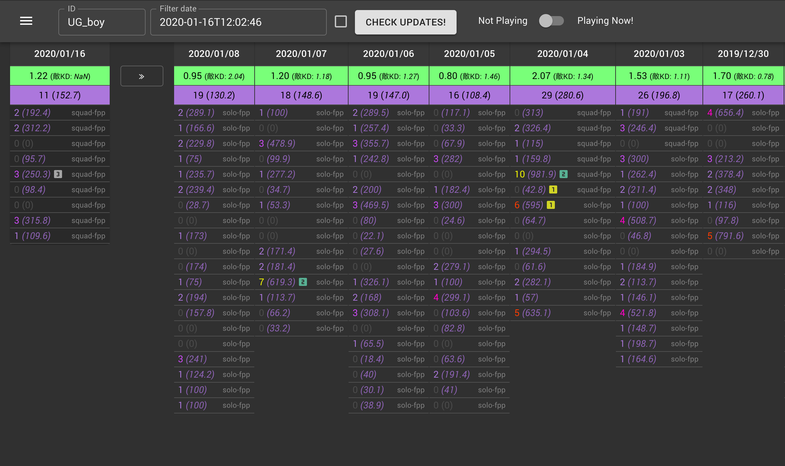
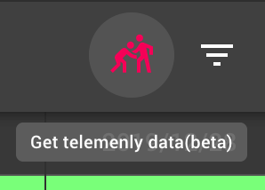
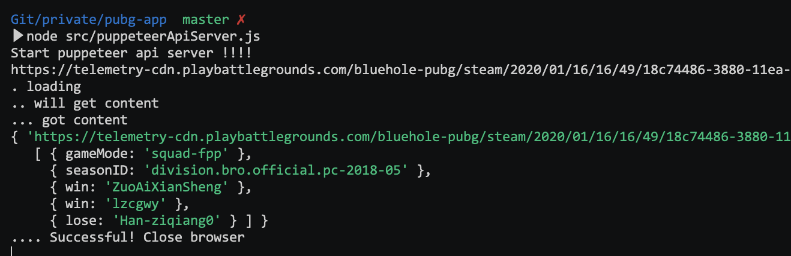

You can get today's kills and Average damages from PUBG API.



Upgraded points from <a href="https://github.com/nakagaw/PUBG_STATS_v1" target="_blank">ver.1</a> are,
1. Made by React & TypeScript with Material UI
2. Hosted by [Firebase Hosting](https://firebase.google.com/products/hosting/), and You can backup to [Firebase Realtime Database}(https://firebase.google.com/products/realtime-database/)
3. You can see Chart by [Recharts](http://recharts.org/)


# 1. Anyway yarn
```
$ yarn
```

# 2. Get your PUBG API and set to .env file
1. Get own PUBG API this site => https://developer.playbattlegrounds.com
2. Create '.env' file on the root dir and put your API key like this:
```
REACT_APP_PUBG_API_KEY=
```

## 2-1. Using Firebase
If you want to use Firebase, doing some init work arong Firebase docs and add some values to '.env' file like this:
```
REACT_APP_FB_API_KEY=
REACT_APP_FB_AUTH_DOMAIN=
REACT_APP_FB_DATABASE_URL=
REACT_APP_FB_PROJECT_ID=
REACT_APP_FB_STORAGE_BUCKET=
REACT_APP_FB_MESSAGING_SENDER_ID=
REACT_APP_FB_APP_ID=
```

# 3. Run
```
$ yarn start
```
Please check this URL.
http://localhost:3000


# 4. After fight, If you want enemies K/D data

Type this commnd to your terminal.
```
$ node src/puppeteerApiServer.js
```
And push "Get telemenly data" icon button.



It takes time, because PUBG API has request limit 10 Requests Per Minute.


